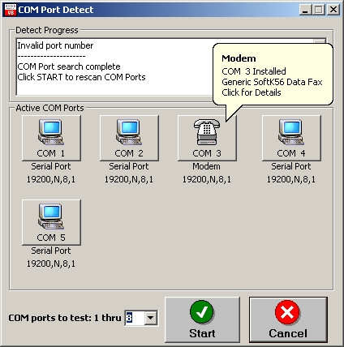



## COM Detect

### Description

Simple app I use for seeing if COM ports are present and if they are in use by another app.

My main use is when installing call acounting systems on PC's. I see what serial ports are

free for the software to use. Nothing real complex, but a usefull tool.
 
### More Info
 

             |
---                |---
**Submitted On**   |2004-12-11 09:34:44
**By**             |[Mark Mokoski](https://github.com/Planet-Source-Code/PSCIndex/blob/master/ByAuthor/mark-mokoski.md)
**Level**          |Beginner
**User Rating**    |4.8 (38 globes from 8 users)
**Compatibility**  |VB 6\.0
**Category**       |[Complete Applications](https://github.com/Planet-Source-Code/PSCIndex/blob/master/ByCategory/complete-applications__1-27.md)
**World**          |[Visual Basic](https://github.com/Planet-Source-Code/PSCIndex/blob/master/ByWorld/visual-basic.md)
**Archive File**   |[COM\_Detect18280412112004\.zip](https://github.com/Planet-Source-Code/mark-mokoski-com-detect__1-57069/archive/master.zip)

